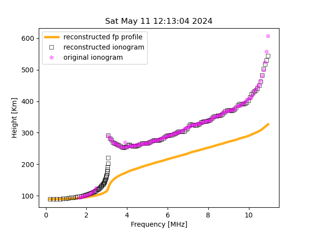

  
  <h3>Inversion algorithm to retrieve the plasma frequency profile</h3>

  A quasi-parabolic approach for inverting ionograms
 

  
  

## Abstract
Inversion of ionograms from vertical measurements is significant for studying the ionospheric structure and ionospheric wave propagation, and it has attracted widespread attention. The model method is a relatively common inversion method for vertical ionograms. A model inversion algorithm based on the multivariate QP model (single quasi-parabolic ionospheric profile model) is proposed, which is different from the traditional QPS model (where the multiple quasi-parabolic segment ionospheric profile model uses quasi-parabolic or anti-parabolic models to represent E, valley, and F1 and F2 layers). In other words, the electron density height profile of each layer in the ionosphere is no longer described by a single QP model. Still, it is based on QP as the basic unit and characterized by a combination of multiple QP units, and the entire vertical ionospheric profile consists of a series of QP unit models. Moreover, in the case of the multivariate QP model, determining the parameters of each layer becomes more complex. This study provides a more straightforward method, which can determine the entire QP unit profile by selecting one of the three parameters of each unit QP. Based on this model, the inversion of vertical ionograms was achieved.

Refer to the accompanying PDF documentation for detailed information on the mathematics and algorithms used.

## How to use
This program expects `.SAO` files, which are commonly used for sharing remote sensing data. These files should be placed in the `/sao_files/` directory. To run the program, simply execute `python3 main.py` in your terminal. As the algorithm solves for the E and F layers, you will see a progress bar. The `avoid_date_list.txt` file lists dates with poor-quality ionograms that should be avoided; otherwise, the program will stop. The final image comparing the results should resemble the examples shown above.

  

## References
- L. Niu, L. Wen, C. Zhou, and M. Deng, ”A profile inversion method for vertical ionograms,” AIP Advances, vol. 14, no.6, p. 065034, Jun. 2024. doi: `10.1063/5.0208687`.
- J.E. Titheridge, ”A new method for the analysis of ionospheric h’(ƒ) records,” Journal of Atmospheric and Terrestrial Physics, vol. 21, no. 1, pp. 1-12, 1961. doi: `10.1016/0021-9169(61)90185-4`.
