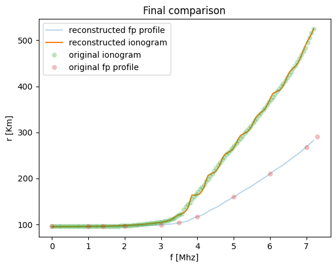
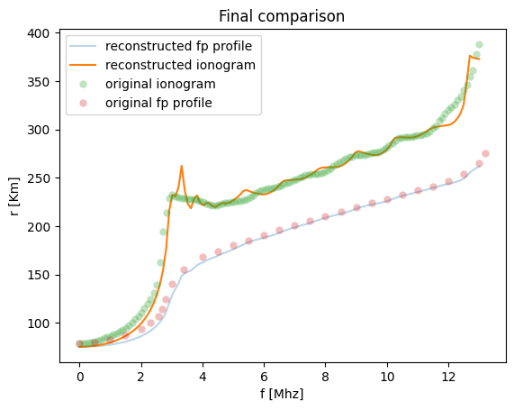
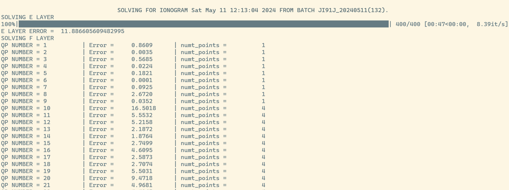

  
  <h3>Inversion algorithm to get the plasma frequency profile</h3>

  A quasi-parabolic approach for inverting ionograms
 

  
  

## Overview
The problem of inverting ionograms into plasma frequency profiles is a longstanding problem with some known approaches. Most of them are closed software written on some antique language. This project is a Python implementation of an inversion algorithm based on quasi-parabolic layers. By alternating between these we are able the construct a smooth curve for the plasma frequency profile while fitting with an least squares error the produced vs the original ionogram.

See the documentation PDF file for details about the math and algorithms. 

## How to use
This program expects `.SAO` files, common for sharing remote sensing data. This files should be placed in the `/sao_files/` directory. Then just run `python3 main.py` in your terminal and you will see a progress bar in your terminal when the algorithm solves for the E layer and F layer. The final image comparing results should look like the ones above.

  

## References
*The first paper has a lot of errors, but the underlying idea is correct. 
- L. Niu, L. Wen, C. Zhou, and M. Deng, ”A profile inversion method for vertical ionograms,” AIP Advances, vol. 14, no.6, p. 065034, Jun. 2024. doi: `10.1063/5.0208687`.
- J.E. Titheridge, ”A new method for the analysis of ionospheric h’(ƒ) records,” Journal of Atmospheric and Terrestrial Physics, vol. 21, no. 1, pp. 1-12, 1961. doi: `10.1016/0021-9169(61)90185-4`.