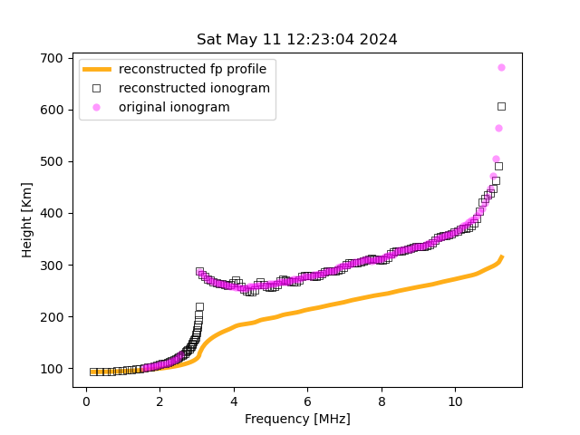
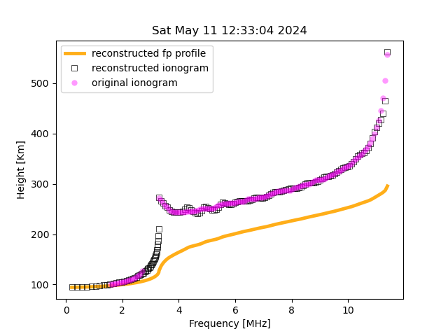
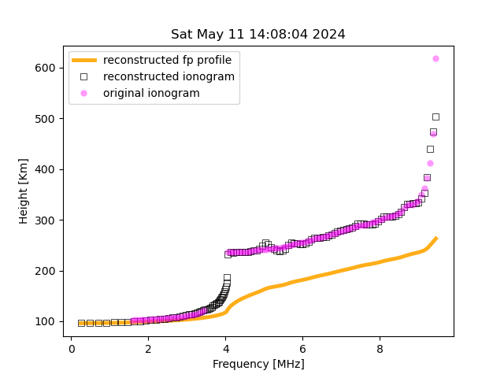
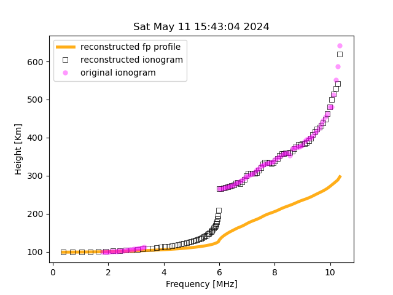

  
  <h3>Inversion algorithm to retrieve the plasma frequency profile</h3>

  A quasi-parabolic approach for inverting ionograms
 

## Abstract
A recent article [AIP Advances 14, 065034 (2024)]
claims to have developed a quasi-parabolic
inspired approach to find the plasma frequency profile from a given ionogram. The authors claim
their algorithm fits the desired ionogram by producing an artificial plasma frequency profile. We
find the paper’s results rather dubious because of the mathematical treatment and numerical values presented.
However, considering the potential of the underlying idea, we present a much clearer exposition of a
multi-quasi-parabolic construction of a plasma frequency profile for the E and F layers given a daylight ionogram. A parabolic profile is assumed for the E layer and the F layer is approximated by a series of concatenated quasiparabolic layers where the continuity of the curve is preserved by assuming a common point between consecutive quasi-parabolic layers where the derivative is the same. The inversion algorithm was applied to daylight ionograms from the Jicamarca Observatory in Lima showing good agreement between the produced synthetic ionogram, calculated from our predicted plasma frequency profile, and the original measured ionogram. 

Refer to the accompanying <a href="Documentation.pdf">paper/documentation pdf</a> for a more detailed description of the mathematics and algorithms used.
## Results
We used data provided by the Jicamarca Radio Observatory located in Lima, Peru. The data is a .SAO file thus providing all the information of the iongram such as the E and F layer critical frequency and the o-mode trace. We find that the program works for ionograms with E and F layer or daytime ionograms.

On top of predicting the electron density profile or, as well known as plasma frequency profile, we can predict the complete form of the E layer which is usually incomplete in the ionograms. 

  
  

  
  

## How to use
This program expects `.SAO` files, which are commonly used for sharing remote sensing data. These files should be placed in the `/sao_files/` directory. To run the program, simply execute `python3 main.py` in your terminal. As the algorithm solves for the E and F layers, you will see a progress bar. The `avoid_date_list.txt` file lists dates with poor-quality ionograms that should be avoided; otherwise, the program will stop. The final image comparing the results should resemble the examples shown above.

  

## References

1. L. Niu, L. Wen, C. Zhou, and M. Deng, "A profile inversion method for vertical ionograms," *AIP Advances*, vol. 14, no. 6, p. 065034, Jun. 2024. doi: [10.1063/5.0208687](https://doi.org/10.1063/5.0208687).

2. J.E. Titheridge, "A new method for the analysis of ionospheric h'(f) records," *Journal of Atmospheric and Terrestrial Physics*, vol. 21, no. 1, pp. 1-12, 1961. doi: [10.1016/0021-9169(61)90185-4](https://doi.org/10.1016/0021-9169(61)90185-4).

3. B. W. Reinisch and X. Huang, "Automatic calculation of electron density profiles from digital ionograms: 3. Processing of bottomside ionograms," *Radio Science*, vol. 18, no. 3, pp. 477-492, 1983. doi: [10.1029/RS018i003p00477](https://doi.org/10.1029/RS018i003p00477).

4. M. H. Reilly and J. D. Kolesar, "A method for real height analysis of oblique ionograms," *Radio Science*, vol. 24, no. 04, pp. 575-583, 1989. doi: [10.1029/RS024i004p00575](https://doi.org/10.1029/RS024i004p00575).

5. J. E. Titheridge, "Direct Manual Calculations of Ionospheric Parameters Using a Single-Polynomial Analysis," *Radio Science*, vol. 2, no. 10, pp. 1237-1253, 1967. doi: [10.1002/rds19672101237](https://doi.org/10.1002/rds19672101237).

6. A. Manjrekar and S. Tulasiram, "Iterative Gradient Correction (IGC) Method for True Height Analysis of Ionograms," *Radio Science*, vol. 58, Nov. 2023, doi: [10.1029/2023RS007808](https://doi.org/10.1029/2023RS007808).

7. K. G. Budden, "The Numerical Solution of the Differential Equations Governing the Reflexion of Long Radio Waves from the Ionosphere. II," *Philosophical Transactions of the Royal Society of London. Series A, Mathematical and Physical Sciences*, vol. 248, no. 939, pp. 45-72, 1955. [Online]. Available: [http://www.jstor.org/stable/91622](http://www.jstor.org/stable/91622).

8. V. K. Forsterling and H. Lassen, "Die Ionisation der Atmosphäre und die Ausbreitung der kurzen elektrischen Wellen (IQ-100 m) über die Erde. III," *Zeitschrift für technis
